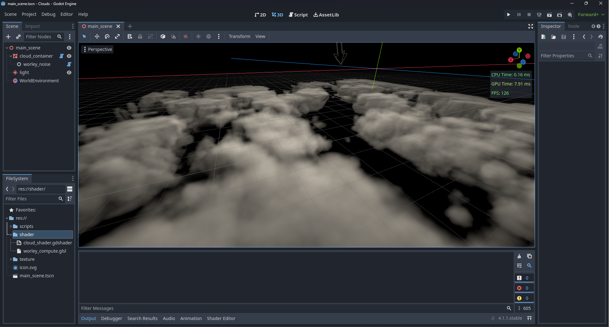

# Godot-Cloud-Shader-Experiment

  

A cloud shader written for Godot 4.1.1 as a personal study to render realtime clouds. It implements the shader and a Worley noise generator as a compute shader. It is heavily inspired by Sebastian Lague's cloud shader, so you might want to check out his video on youtube as well.
## License
MIT license (see license.md)

## How to use
The first thing you can do is create the Worley noise that describes the shape how the clouds will look like. To do this, go to the "worley_noise" node and play around with the parameters. Here you need to generate a density map and a detailed one (by checking the "Is Detailed" box) and change a parameter.
After that you can go to the "cloud" node and under "Surface Material Override" you will find all the different settings for this shader that you can adjust to your liking.

## Disclaimer
First of all, the 3D-Texture created are not saved, so if you close the application and open it again, the texture will be gone since I couldn't find a direct way to avoid this unfortunately. The other thing important to mention here is that this cloud shader is very demanding for the GPU, for example on my RTX 4070 it ran about 120 FPS when I zommed into it (FPS will depend on how much you zoomed into the scene since the cloud shader is raytraced per pixel) so be aware of that before playing around with it. 